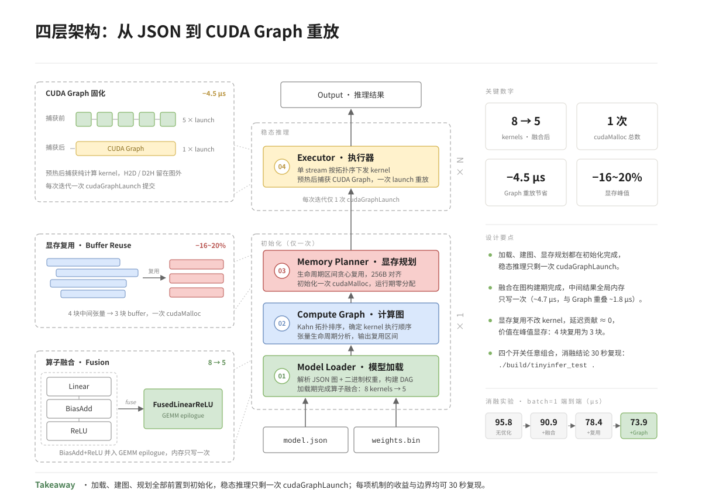

# TinyInfer —— 面向小模型场景的 CUDA 推理引擎

> 支持计算图加载、算子融合、静态显存规划与 CUDA Graph 固化的 GPU 推理引擎。
> 支持线性 MLP（Linear / BiasAdd / ReLU / Softmax），FP32，固定 Shape，batch ∈ [1, 8]，单 NVIDIA GPU。
> 专为小规模 MLP（hidden ≤ 1024，batch ≤ 8，FP32）设计。
> 定位：**教学型推理引擎 + 可控消融实验平台**。


## 目录结构

```
Tiny_Infer/
├── include/tinyinfer/          # 引擎头文件
│   ├── common.h                # 公共类型与工具
│   ├── tensor.h                # 张量封装
│   ├── op.h / ops.h            # 算子定义与注册
│   ├── registry.h              # 算子注册表
│   ├── graph.h                 # 计算图（DAG）
│   ├── memory.h                # 静态显存规划器
│   ├── executor.h              # 执行器（含 CUDA Graph）
│   ├── kernels_launcher.h      # Kernel 启动封装
│   ├── model.h                 # 模型加载器
│   └── json_min.h              # 轻量 JSON 解析
├── src/                        # 引擎实现
│   ├── kernels.cu              # 手写 tiling GEMM + 融合算子
│   ├── graph.cpp               # 拓扑排序 + 生命周期分析
│   ├── memory.cpp              # 显存复用分配
│   ├── executor.cpp            # 执行 + CUDA Graph 捕获/重放
│   ├── model.cpp               # JSON + 二进制权重加载
│   ├── common.cpp              # 公共工具实现
│   └── main.cpp                # CLI 入口
├── test/
│   └── test_main.cpp           # 统一测试入口
├── models/                     # 模型 JSON 与二进制权重
├── data/                       # 测试输入与参考输出
├── tools/
│   ├── gen_weights.py          # 权重与测试数据生成
│   └── ort_baseline.py         # ONNX Runtime 基线对比
├── docs/
│   └── motivation_report.md    # 阶段零动机验证报告
├── CMakeLists.txt
├── .gitignore
└── LICENSE
```

## 四层架构



加载、建图与显存规划均在初始化阶段完成，稳态推理只剩一次 `cudaGraphLaunch`。

## 项目动机

开发前用 ONNX Runtime 基线验证了两个前置假设（完整数据见
[docs/motivation_report.md](docs/motivation_report.md)）：

- **H1（通用框架开销 ≥ 2×）：不成立。** ORT 1.23 在纯 CPU（Xeon 4214R）上跑
  mlp_large batch=1 仅需 ~48 μs，比本引擎 GPU 全优化配置（~74 μs）还快。
- **H2（Launch 开销占比 ≥ 30%）：部分成立但被高估。** 实测单次 kernel launch
  约 1.4 μs，在 8-kernel 链路中占比仅 5~10%。

因此本项目不声称「比通用框架快」。价值在于：把推理引擎的四大机制完整实现
一遍，并用 **30 秒即可复现的消融数据**，讲清楚每项优化的真实收益与边界。

## 三个核心优化（收益均可复现）

1. **FusedLinearReLU 融合算子**：GEMM epilogue 阶段就地完成 BiasAdd+ReLU，
   全局内存只写一次。实测独立收益 ~4.7 μs（batch=1），其中 ~1.8 μs 与
   CUDA Graph 省下的 launch 开销重叠（2×2 解耦实验，见下文）。
2. **静态显存规划**：按生命周期区间贪心复用中间 buffer，256B 对齐，
   初始化一次 `cudaMalloc`，运行期零分配。对延迟的贡献 ≈ 0（符合预期），
   价值体现在显存：mlp_large 的 4 块中间张量复用为 3 块 buffer，峰值降 16~20%。
3. **CUDA Graph 固化**：预热后把纯计算 kernel 序列捕获为一张图，后续每次
   迭代一次 `cudaGraphLaunch` 提交。实测省 ~4.5 μs。
   H2D/D2H 留在图外，通过固定地址交互。

## Benchmark（实测数据）

测试环境：RTX 3080 Ti / CUDA 11.8 / 驱动 580.76.05 / Xeon Silver 4214R。
模型：mlp_large（1024→512→256→128→10）。口径：预热 100 + 测量 1000 次，
cudaEvent GPU 端计时（不含 H2D/D2H）。复现：`./build/tinyinfer_test .`

延迟单位 μs（mean；完整 mean±std/P50/P99/min 见测试输出）：

| 配置 | kernels | batch=1 | batch=4 | batch=8 |
|---|---|---|---|---|
| Config 0 无优化 | 8 | 95.8 | 83.6 | 84.3 |
| Config 1 +融合 | 5 | 90.9 | 79.0 | 79.2 |
| Config 2 +显存复用 | 5 | 78.4 | 79.1 | 82.5 |
| Config 3 +CUDA Graph | 5 | 73.9 | 74.6 | 76.0 |
| cuBLAS 基线（参照） | 12 | 53.0 | 53.4 | 70.1 |
| ORT 参照（CPU，wall time） | - | 48.1 | - | 136.7 (P50) |

融合 × Graph 2×2 解耦（batch=1，reuse 关闭）：

| fuse \ graph | 关 | 开 |
|---|---|---|
| 关 | 82.9 | 76.8 |
| 开 | 78.3 | 74.0 |

单独开融合省 4.7 μs；在 Graph 已开启时，融合的边际收益收窄为 2.9 μs——
交互项 ~1.8 μs，即融合省下的 launch 开销中已被 Graph 覆盖的部分。

## 构建与运行

```bash
python3 tools/gen_weights.py        # 生成 mlp3 / mlp_large 权重与 batch{1,4,8} 数据
cmake -S . -B build -DCMAKE_CUDA_ARCHITECTURES=86   # 按显卡调整：A100=80 T4=75
cmake --build build -j8
```

```bash
# 推理（开关可任意组合）
./build/tinyinfer --model models/mlp_large.json --input data/mlp_large_b1.bin
./build/tinyinfer --model models/mlp_large.json --input data/mlp_large_b8.bin --batch 8 --bench
./build/tinyinfer --model models/mlp_large.json --input data/mlp_large_b1.bin --no-fuse --no-reuse --no-graph
./build/tinyinfer --model models/mlp_large.json --input data/mlp_large_b1.bin --cublas  # cuBLAS 基线

# 统一测试：数值正确性（全配置 × batch{1,4,8}）+ 显存对比 + 消融基准 + 2×2 解耦
./build/tinyinfer_test .

# 阶段零 ORT 基线（需 pip install onnxruntime onnx）
python3 tools/ort_baseline.py 1
```

## 局限性

- 不支持 CNN/Transformer、动态 Shape、FP16/INT8、Tensor Core、多卡多流、
  服务化部署；
- 手写 GEMM 为通用 tiling 实现，未做 skinny 形状特化，性能落后于 cuBLAS
  （Config 3 74 μs vs cuBLAS 53 μs）——瓶颈在 M ≤ 8 时 tiling kernel 并行度
  不足，split-K / GEMV 专用路径是已识别的改进方向（未实施）。本项目不以替代
  cuBLAS 为目标；
- 显存复用对延迟无显著影响（Config 1→2 差异 < 2×stddev），符合预期——
  它不改动任何 kernel，价值体现在显存类指标（峰值降 16~20%，见上）。
- 同环境两次重测存在 ~10% 漂移（GPU 时钟策略），消融结论均按
  「增量 ≥ 2×stddev 才视为显著」判读；
- 模型格式为自定义 JSON + 二进制权重（`tools/gen_weights.py` 可生成示例）。
